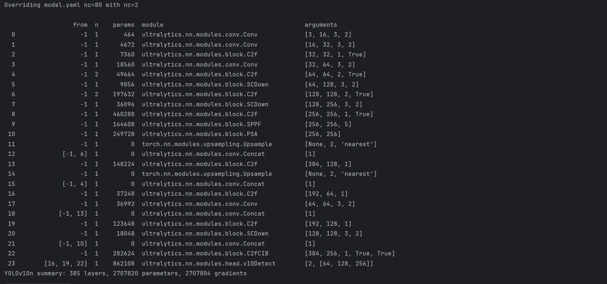

# 说明

本次代码运行基于自定义数据集SafetyHelmentWearingDatasets(安全帽监测数据集)进行训练、输出。

此次运行对过程进行了适当简化，以提高效率

## 输出

输出列出了模型中的各个层（layers）和它们对应的参数。这些层包括不同类型的卷积层（Conv）、瓶颈块（C2f）、下采样块（ScDown）、空间金字塔池化聚焦（SPPF）、路径聚合（PSA）、上采样层（Upsample）和连接层（Concat）。每个层都附有其具体的参数，如输入/输出通道数、卷积核大小、步长等，这些参数共同定义了模型的架构和功能。nc=2的修改影响了模型中的最后一层（通常是分类层或检测头），因为这决定了输出层的大小和维度。这意味在目标检测中，模型将只识别并定位两种不同类型的对象。此外，总层数（385层）、总参数数（2707820个）和可训练参数数（2707804个）。

这段输出是进行目标检测模型性能验证的结果。该模型在Python 3.9.19和PyTorch 2.0.1+cpu环境下运行，使用的CPU是AMD Ryzen 7 7840H，并配备了Radeon 780M图形卡。

模型包含285层，总共有2695196个参数。验证的模型权重文件位于C:\Users\25119\Desktop\Python_begin\yolov10\runs\detect\train_v102\weights\best.pt。 使用了YOLOv10的YOLOv10-N版本，每张图片的处理时间被分解为预处理（1.0ms）、推理（74.3ms）、损失计算（0ms，因为验证阶段不计算损失）、后处理（0.2ms）。

模型对2张图片进行了评估，这些图片共包含184个实例（即目标对象）。

提供了多个评估指标，如Box Precision (P)、mAP50、mAP50-95等，分别代表在不同IoU阈值下的平均精度。具体来说，对于所有类别的平均，精度为0.709，mAP50为0.608，mAP50-950.713。

对于“helmet”和“nohelmet”这两个类别，也分别给出了详细的评估结果。

