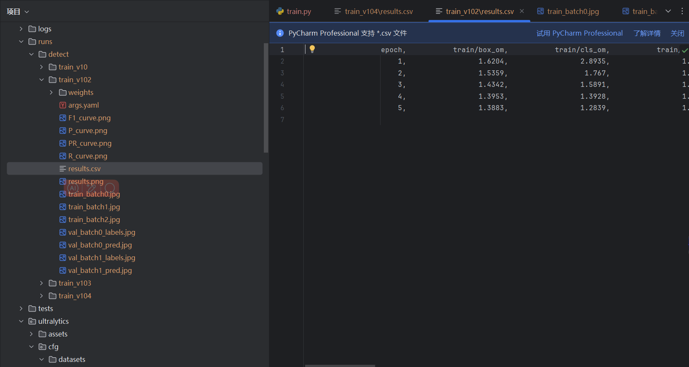

# 说明

本次代码运行基于（自定义）安全帽监测数据集SafetyHelmentWearingDatasets（包含270张图片）进行训练、输出。

此次运行对过程进行了适当简化，以提高效率

## 输出

输出列出了模型中的各个层（layers）和它们对应的参数。这些层包括不同类型的卷积层（Conv）、瓶颈块（C2f）、下采样块（ScDown）、空间金字塔池化聚焦（SPPF）、路径聚合（PSA）、上采样层（Upsample）和连接层（Concat）。每个层都附有其具体的参数，如输入/输出通道数、卷积核大小、步长等，这些参数共同定义了模型的架构和功能。nc=2的修改影响了模型中的最后一层（通常是分类层或检测头），因为这决定了输出层的大小和维度。这意味在目标检测中，模型将只识别并定位两种不同类型的对象。此外，总层数（385层）、总参数数（2707820个）和可训练参数数（2707804个）。

这段输出是进行目标检测模型性能验证的结果。该模型在Python 3.9.19和PyTorch 2.0.1+cpu环境下运行。

模型包含285层，总共有2695196个参数。验证的模型权重文件位于C:\Users\25119\Desktop\Python_begin\yolov10\runs\detect\train_v102\weights\best.pt。 使用了YOLOv10的YOLOv10-N版本，每张图片的处理时间被分解为预处理（1.0ms）、推理（74.3ms）、损失计算（0ms，因为验证阶段不计算损失）、后处理（0.2ms）。

模型对2张图片进行了评估，这些图片共包含184个实例（即目标对象）。

提供了多个评估指标，如Box Precision (P)、mAP50、mAP50-95等，分别代表在不同IoU阈值下的平均精度。具体来说，对于所有类别的平均，精度为0.709，mAP50为0.608，mAP50-950.713。

对于“helmet”和“nohelmet”这两个类别，也分别给出了详细的评估结果。

这是模型的输出目录
模型文件：
权重文件（Weights）：以weights格式存储，包含了模型训练后学习到的参数。

配置文件：
训练配置文件（Args Files）：包含模型训练过程中的各种配置参数，如学习率、批次大小、训练轮次等。这些文件以.yaml等格式存储。

结果文件：
检测结果（Detection Results）：模型对测试集或新图像进行推理后产生的结果，包括边界框坐标、类别标签、置信度等信息。这些结果以.csv、图像文件（如.png）的形式存储。results.csv和results.png可能分别存储了检测结果的数据和可视化图像。

预测图像（Prediction Images）：包含模型预测结果的图像文件，如val_batch0_pred.jpg可能展示了模型对验证集中某个批次图像的预测结果。

可视化图表：
性能评估图表（Performance Evaluation Charts）：如F1曲线、P-R曲线等，用于评估模型的性能。F1_curve.png、P_curve.png、PR_curve.png和R_curve.png分别展示了F1分数、精确率-召回率曲线等性能评估图表。

原始数据和标注：
训练图像（Training Images）：用于模型训练的原始图像文件，如train_batch0.jpg、train_batch1.jpg等。

标注文件（Labels）：与训练图像对应的标注文件，包含了图像中目标的边界框坐标和类别标签。如val_batch0_labels.jpg，这里是指对标注结果进行可视化的图像。

