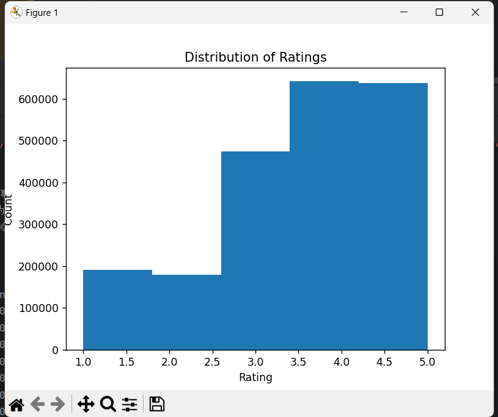
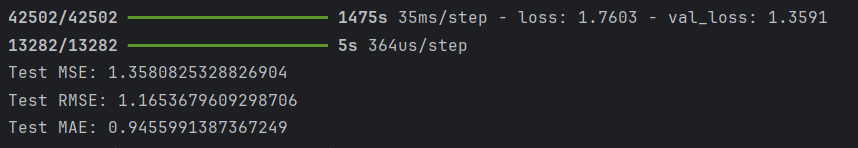

# 说明

这段代码实现了一个基于矩阵分解的推荐系统，基于dmsc_v2数据集,完成了一个推荐系统的构建、训练、评估和保存工作.

# 导入库
```python
import pandas as pd
from sklearn.model_selection import train_test_split
from sklearn.preprocessing import LabelEncoder
import tensorflow as tf
from tensorflow.keras.layers import Embedding, Dot, Dense, Flatten
from tensorflow.keras import Model
from tensorflow.keras.optimizers import Adam
import matplotlib.pyplot as plt
```
其中pandas 用于数据处理，sklearn 用于数据划分和特征编码，tensorflow 和 keras 用于构建和训练神经网络模型，matplotlib 用于数据可视化。

# 数据处理

## 数据读取和可视化
```python
# 读取数据
data_ratings = pd.read_csv('dmsc_v2/ratings.csv')

# 数据探索和可视化
print(data_ratings.head())
print(data_ratings.describe())
plt.hist(data_ratings['rating'], bins=5)
plt.xlabel('Rating')
plt.ylabel('Count')
plt.title('Distribution of Ratings')
plt.show()
```
从 CSV 文件中读取用户评分数据。打印数据的前几行和描述统计信息。绘制评分分布的直方图。

## 特征编码
```python
# 特征编码
le_user = LabelEncoder()
le_movie = LabelEncoder()
data_ratings['user_encoded'] = le_user.fit_transform(data_ratings['userId'])
data_ratings['movie_encoded'] = le_movie.fit_transform(data_ratings['movieId'])
```
使用 LabelEncoder 将用户 ID 和电影 ID 编码为连续整数，这有助于嵌入层的使用

## 特征和标签选择
```python
# 选择特征和标签
X = data_ratings[['user_encoded', 'movie_encoded']]
y = data_ratings['rating']
```
X 包含编码后的用户和电影 ID,y 包含对应的评分。

## 数据划分
```python
# 数据划分
X_train, X_test, y_train, y_test = train_test_split(X, y, test_size=0.2, random_state=42)
```
将数据划分为训练集和测试集，其中 20% 的数据用于测试。

# 模型结构

```python
class MatrixFactorizationModel(Model):
    def __init__(self, num_users, num_movies, embedding_dim):
        super(MatrixFactorizationModel, self).__init__()
        self.user_embedding = Embedding(num_users, embedding_dim)
        self.movie_embedding = Embedding(num_movies, embedding_dim)
        self.dot = Dot(axes=1)
        self.prediction = Dense(1, activation='linear')

    def call(self, inputs):
        user_vec = self.user_embedding(inputs[:, 0])
        user_vec = Flatten()(user_vec)
        movie_vec = self.movie_embedding(inputs[:, 1])
        movie_vec = Flatten()(movie_vec)
        dot_product = self.dot([user_vec, movie_vec])
        prediction = self.prediction(dot_product)
        return prediction
```
定义了一个矩阵分解模型。模型包括：
用户嵌入层：将用户编码转换为低维向量。
电影嵌入层：将电影编码转换为低维向量。
点积层：计算用户和电影向量的点积。
预测层：对点积结果进行线性变换以得到最终的评分预测。

# 损失函数

```pyython
# 实例化模型
num_users = len(le_user.classes_)
num_movies = len(le_movie.classes_)
embedding_dim = 10
model = MatrixFactorizationModel(num_users, num_movies, embedding_dim)

# 编译模型
model.compile(optimizer=Adam(learning_rate=0.01), loss='mse')
```
实例化模型时，指定用户数、电影数和嵌入维度。
编译模型，使用 Adam 优化器和均方误差（MSE）损失函数。

# 训练模型

```python
# 准备测试数据格式
X_test_reshaped = X_test.values.reshape(-1, 2)

# 训练模型
history = model.fit(X_train.values.reshape(-1, 2), y_train, epochs=10, batch_size=32, verbose=1, validation_split=0.2)
```
将测试数据重塑为合适的格式。训练模型，设置训练参数如训练次数、批量大小等。

## 绘制训练和验证损失图
```python
# 绘制训练和验证损失图
plt.plot(history.history['loss'], label='Train Loss')
plt.plot(history.history['val_loss'], label='Validation Loss')
plt.xlabel('Epoch')
plt.ylabel('Loss')
plt.title('Training and Validation Loss')
plt.legend()
plt.show()
```
绘制训练和验证损失随训练次数的变化图，以便观察模型的训练过程。
## 评估模型
```python
# 评估模型
predictions = model.predict(X_test_reshaped).flatten()
mse = tf.keras.losses.MSE(y_test, predictions).numpy()
print(f'Test MSE: {mse}')

# 计算更多的评估指标
rmse = tf.sqrt(mse).numpy()
mae = tf.keras.losses.MAE(y_test, predictions).numpy()
print(f'Test RMSE: {rmse}')
print(f'Test MAE: {mae}')
```
使用测试数据评估模型，计算 MSE、RMSE 和 MAE。
## 保存和加载模型
```python
# 保存模型
model.save('matrix_factorization_model.keras')

# 加载模型并进行预测
from tensorflow.keras.models import load_model

loaded_model = load_model('matrix_factorization_model.keras', custom_objects={'MatrixFactorizationModel': MatrixFactorizationModel})
loaded_predictions = loaded_model.predict(X_test_reshaped).flatten()
loaded_mse = tf.keras.losses.MSE(y_test, loaded_predictions).numpy()
print(f'Loaded Model Test MSE: {loaded_mse}')
```
将模型保存为 .keras 文件。
加载保存的模型并进行预测，验证模型加载是否成功。

# 测试结果


输出1展示了不同评级的出现次数或分布情况。



训练过程输出：
42502/42502, 1475s 35ms/step - loss: 1.7603 - val_loss: 1.3591：这部分信息表示模型在整个训练集上完成了42502个步骤（可能是批次或样本），总共耗时1475秒，平均每个步骤耗时35毫秒。训练过程中的平均损失（loss）为1.7603，验证集上的平均损失（val_loss）为1.3591。这说明了模型在训练集和验证集上的性能差异，验证集上的损失略低，表明模型在未见过的数据上表现稍好。
测试集评估：
TestMSE: 1.3580825328826904：测试集上的均方误差为1.3580825328826904。MSE是衡量模型预测值与真实值差异的一个常用指标，值越小表示模型预测越准确。
Test RMSE: 1.1653679609298706：测试集上的均方根误差。
TestMAE: 0.9455991387367249：测试集上的平均绝对误差为0.9455991387367249。
从这些指标来看，模型在测试集上的表现（特别是RMSE和MAE）相对较好。


